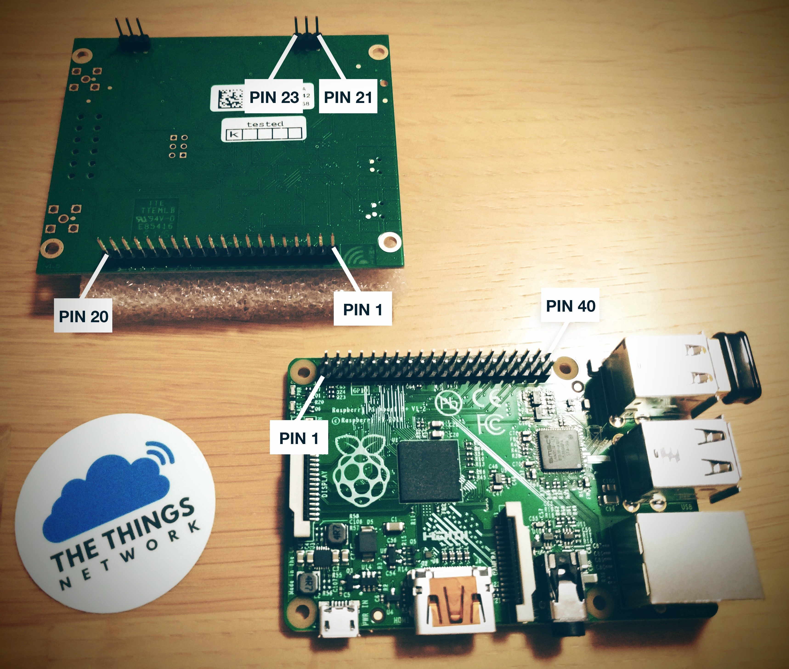

# The Things Network: iC880a-based gateway

Reference setup for [The Things Network](http://thethingsnetwork.org/) gateways based on the iC880a SPI concentrator with a Raspberry Pi host.

This installer targets the **SPI version** of the board, if you have the USB version, [check this branch](https://github.com/ttn-zh/ic880a-gateway/tree/master).

## Hardware setup

First, connect the concentrator board to the Raspberry Pi as follows:

iC880a pin      | Description   | RPi physical pin
----------------|---------------|-----------------
21              | Supply 5V     | 2
22              | GND           | 6
13              | Reset         | 22
14              | SPI CLK       | 23
15              | MISO          | 21
16              | MOSI          | 19
17              | NSS           | 24

Now you're ready to start the software setup.

## Software setup (Raspbian)

- Download [Raspbian Jessie Lite](https://www.raspberrypi.org/downloads/)
- Follow the [installation instruction](https://www.raspberrypi.org/documentation/installation/installing-images/README.md) to create the SD card
- Connect an Ethernet cable to the RPi
- Plug the power supply of the RPi which will also power the concentrator board (**WARNING**: never power up without the antenna!)
- From a computer in the same LAN, `ssh` into the RPi using the default hostname:

        local $ ssh pi@raspberrypi.local

- Use `raspi-config` utility to **enable SPI** (`9 Advanced options -> A6 SPI`) and also expand the filesystem (`1 Expand filesystem`):

        $ sudo raspi-config

- Reboot
- Configure locales and time zone:

        $ sudo dpkg-reconfigure locales
        $ sudo dpkg-reconfigure tzdata

- Make sure you have an updated installation and install `git`:

        $ sudo apt-get update
        $ sudo apt-get upgrade
        $ sudo apt-get install git

- Create new user for TTN and add it to sudoers

        $ sudo adduser ttn
        $ sudo adduser ttn sudo

- Logout and login as `ttn` and remove the default `pi` user

        $ sudo userdel -rf pi

- Clone the installer and start the installation

        $ git clone https://github.com/ttn-zh/ic880a-gateway.git ~/ic880a-gateway
        $ cd ~/ic880a-gateway
        $ sudo ./install.sh spi

# Credits

These scripts are largely based on the awesome work by [Ruud Vlaming](https://github.com/devlaam) on the [Lorank8 installer](https://github.com/Ideetron/Lorank).
